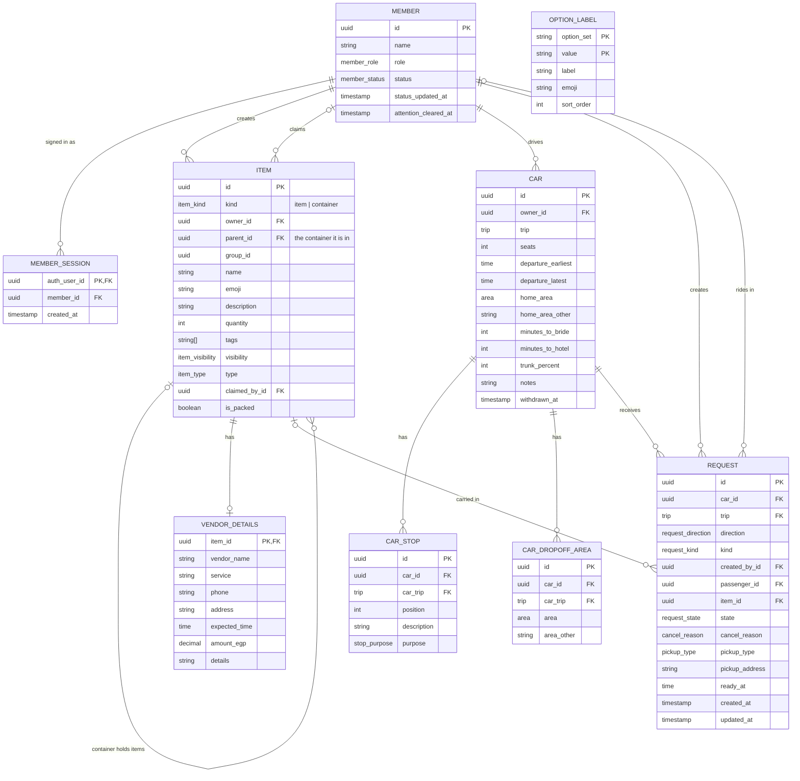

# Bridal Party Coordination App: Entity Relationship Diagram

This ERD is based on the business requirements (BR-01 to BR-34).

## Diagram

## Enums

| Enum | Values |
|---|---|
| `member_role` | bride, maid_of_honor, bridesmaid |
| `member_status` | at_home, at_brides_house, transporting_to_hotel, between_hotel_and_venue, personal_errand, errand_for_bride, doing_makeup, dressing_up, photo_session, at_venue, heading_home |
| `item_kind` | item, container |
| `item_visibility` | private, shared |
| `item_type` | personal, claimable |
| `trip` | to_hotel, hotel_to_venue, return_home |
| `area` | maadi, zahraa_el_maadi, october, other |
| `stop_purpose` | myself, bride |
| `request_direction` | ask, offer |
| `request_kind` | passenger, cargo |
| `request_state` | pending, confirmed, declined, cancelled |
| `cancel_reason` | by_sender, left_car, car_withdrawn, auto |
| `pickup_type` | bride_home, vendor_address, custom |

`OPTION_LABEL` holds the display text, emoji, and order for each enum value, keyed by `(option_set, value)`. `trunk_percent` uses the option set `trunk_percent` with values 0, 25, 50, 75, and 100.

## Design Decisions

**Containers are items.** A bag or box is an `ITEM` row with `kind = container`, and items point to their container through `parent_id`. Containers appear in the Items list with no extra UI, and cargo requests need only one reference (`item_id`). This uses one table with a `kind` column, not Postgres `INHERITS`, because table inheritance doesn't carry unique constraints or foreign keys to child tables.

**Vendor details are a one-to-one extension.** `VENDOR_DETAILS` uses `item_id` as its primary key, so an item has at most one set of vendor details. This keeps vendor columns off every other item and container. An item "has vendor details" when a `VENDOR_DETAILS` row exists (BR-28).

**The trip on a request is enforced, not just copied.** `REQUEST.trip` exists so the database can enforce "one confirmed car per trip" with a unique index. A composite foreign key `(car_id, trip)` referencing `CAR (id, trip)` guarantees it always matches the car's trip.

**Sign-in uses anonymous sessions.** Members sign in by picking their name (BR-03), with no passwords. The app creates a Supabase anonymous session, and `sign_in` links it to the chosen member in `MEMBER_SESSION`. A member can have several sessions, one per phone. `sign_out` deletes the session's row.

**Trips are an enum, not a table.** Trips have no data of their own (BR-12).

**Copies share a `group_id`.** An original item and all its copies share one `group_id` (BR-07). The shared list groups rows by it, so deleting the original doesn't break the group (BR-07b).

**Container visibility is derived.** A container is shared if any item in it is shared (BR-10).

**Display labels come from the backend.** Columns use native enums so the database enforces valid values, and the UI builds every dropdown and badge from `OPTION_LABEL`.

**Nothing display-related is stored.** Subtitles such as "In: Blue bag · Packed" and each member's buttons are computed by the read model.

**The responder is derived.** For an Ask, the responder is the car owner. For an Offer, the responder is the passenger or the cargo's owner.

**The cargo's owner is derived.** For a container or a personal item, it's `owner_id`. For a claimable item, it's `claimed_by_id` (BR-24).

**Some columns are intentionally nullable.** The to-hotel-only fields on `CAR`, the cargo-only fields on `REQUEST`, and the item-only fields that are empty for containers stay as nullable columns enforced by check constraints. Splitting them into separate tables would add more joins than it removes.

## Constraints

### Members
- `status` defaults to `at_home` (BR-26).

### Items (`kind = item`)
- `visibility`, `type`, and `group_id` are required.
- `type = claimable` requires `visibility = shared` (BR-06).
- `claimed_by_id` can be set only when `type = claimable`, and only the claimer can clear it (BR-08).
- A `VENDOR_DETAILS` row can exist only for a claimable item (BR-28).

### Containers (`kind = container`)
- `visibility`, `type`, `group_id`, `quantity`, and `claimed_by_id` must be null.
- No `VENDOR_DETAILS` row.
- A container can't be inside another container: its `parent_id` must be null.

### Container membership
- `parent_id` must point to a row with `kind = container`.
- An item can be placed in a container only if `item.owner_id = container.owner_id` or `item.claimed_by_id = container.owner_id` (BR-10).

### Cars
- One active car per member per trip: `UNIQUE (owner_id, trip) WHERE withdrawn_at IS NULL`, so a member can register again after withdrawing.
- `UNIQUE (id, trip)`, the target of the composite foreign key from `REQUEST`.
- `seats >= 0`.
- `departure_earliest <= departure_latest`.
- `trunk_percent` is one of 0, 25, 50, 75, or 100.
- `home_area`, `minutes_to_bride`, and `minutes_to_hotel` are allowed only when `trip = to_hotel`, and `home_area` is required then (BR-14).
- Stops are allowed only on To the hotel cars, and drop-off areas only on Return home cars (BR-14, BR-15). Each table enforces this with a fixed `car_trip` column (`to_hotel` or `return_home`) and a composite foreign key `(car_id, car_trip)` referencing `CAR (id, trip)`.
- `home_area_other` and `area_other` are required when the area is `other`, and must be null otherwise.

### Requests
- `FOREIGN KEY (car_id, trip) REFERENCES CAR (id, trip)`.
- `kind = passenger` requires `passenger_id` and a null `item_id`. `kind = cargo` requires `item_id` and a null `passenger_id`.
- `pickup_type` is required for cargo and must be null for passengers. `pickup_address` is required only when `pickup_type = custom`. `vendor_address` is allowed only when the item has vendor details with an address. `ready_at` is optional for cargo and must be null for passengers (BR-24).
- `cancel_reason` is set only when `state = cancelled`.
- Deleting an item sets `item_id` to null on its requests, which are cancelled first. The cancelled request stays, so the car owner still sees it in "Needs your attention."
- One confirmed car per trip:
  - `UNIQUE (trip, passenger_id) WHERE state = 'confirmed'`
  - `UNIQUE (trip, item_id) WHERE state = 'confirmed'`
- No passenger requests to a full car (BR-23).
- Unclaimed items can't be cargo (BR-24).
- Items inside a container can't be cargo on their own (BR-11).
- Requests can't target a withdrawn car.

## Triggers and Server Logic

| Event | Effect | Requirement |
|---|---|---|
| A request is confirmed | Cancel the same passenger's or item's other pending requests on that trip (`cancel_reason = auto`). | BR-22 |
| A car's last seat is filled | Cancel the car's remaining pending passenger requests (`auto`). | BR-23 |
| A passenger or cargo owner withdraws from a car | Cancel the confirmed request (`left_car`), freeing the seat. | BR-21 |
| A car is withdrawn | Cancel all of its pending and confirmed requests (`car_withdrawn`). | BR-19 |
| A claim is released | Remove the item from its container and cancel its pending and confirmed cargo requests (`auto`). | BR-08 |
| An item is moved into a container | Cancel the item's own pending and confirmed cargo requests (`auto`). | BR-11 |
| A member taps "Got it" on the home screen | Set `attention_cleared_at` to now. The home screen shows pending requests where they are the responder, plus requests cancelled since `attention_cleared_at`. | BR-34 |

## Read Model (for a thin UI)

The UI reads only through the read endpoints and changes data only through the write functions defined in the backend contract (`wedding-app-backend-contract.md`). Every list returns ready-to-display rows with an `actions` list of the buttons the member is allowed to use.
